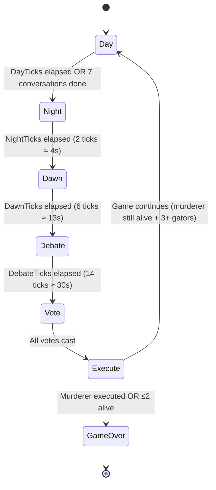

<div align="center">

# 🐊 Swamp of Salem

### *An AI-powered murder-mystery social simulation*


[](https://dotnet.microsoft.com/)
[](https://github.com/microsoft/semantic-kernel)
[](https://developer.mozilla.org/en-US/docs/Web/JavaScript)
[](https://dotnet.microsoft.com/)
[](LICENSE)
[](https://openai.com/)

> **Six alligators. One murderer. Nobody knows who. Let the AI figure it out.**

</div>

---

## 📚 Deep-Dive Documentation

> **New to the project? Start here!** The docs below are written specifically for junior developers.

| 📄 Doc | What's inside |
|--------|--------------|
| [🏗️ docs/ARCHITECTURE.md](docs/ARCHITECTURE.md) | System design, request lifecycle, dual-clock model, conversation pipeline, memory system, DI setup, circular import solution, design decisions |
| [🗺️ docs/FRONTEND.md](docs/FRONTEND.md) | Every JS module explained, module dependency graph, the full `Person` object field reference, common patterns, debugging tips |
| [⚙️ docs/BACKEND.md](docs/BACKEND.md) | All four .NET projects, API endpoint reference, Semantic Kernel agent lifecycle, prompt architecture, step-by-step guide to adding endpoints |
| [🎮 docs/GAME_MECHANICS.md](docs/GAME_MECHANICS.md) | Full game cycle, phase reference, stats formulas, relations math, suspicion system, gossip spreading, murder victim algorithm, vote rules, personality archetypes, win conditions, tuning guide |
| [📦 docs/CLASSES.md](docs/CLASSES.md) | Every C# class — purpose, key properties/methods, and how each one connects to the rest of the system |

> 💡 **Reading order for new devs:** `README` → `ARCHITECTURE` → `GAME_MECHANICS` → `FRONTEND` or `BACKEND` depending on what you're working on.
> 💡 **Per-project quick references:** Each project folder has its own `README.md` — [`SwampOfSalem.Shared`](SwampOfSalem.Shared/README.md), [`SwampOfSalem.AppLogic`](SwampOfSalem.AppLogic/README.md), [`SwampOfSalem.SK`](SwampOfSalem.SK/README.md), [`SwampOfSalem.Gators`](SwampOfSalem.Gators/README.md), [`SwampOfSalem.Web`](SwampOfSalem.Web/README.md).

---

## 📖 Table of Contents

| # | Section | What you'll learn |
|---|---------|-------------------|
| 1 | [🎮 What Is This?](#-what-is-this) | High-level app purpose |
| 2 | [🌀 How the Game Works](#-how-the-game-works) | Phase cycle, win conditions |
| 3 | [🏗️ Architecture Overview](#%EF%B8%8F-architecture-overview) | Four-layer diagram |
| 4 | [📁 Project Structure](#-project-structure) | File-by-file breakdown |
| 5 | [🛠️ Tech Stack](#%EF%B8%8F-tech-stack) | Languages & libraries |
| 6 | [🔍 Layer-by-Layer Walkthrough](#-layer-by-layer-walkthrough) | Deep-dive on each project |
| 7 | [📊 Data Flow Diagrams](#-data-flow-diagrams) | How data moves at runtime |
| 8 | [🎭 Personality System](#-personality-system) | The six archetypes explained |
| 9 | [💘 Relationship & Suspicion System](#-relationship--suspicion-system) | How bonds & distrust work |
| 10 | [🦷 Bite & Fight-or-Flight System](#-bite--fight-or-flight-system) | Biting, fear, and social fallout |
| 11 | [🧠 AI Prompt Architecture](#-ai-prompt-architecture) | What the LLM actually receives |
| 12 | [🔄 Game Phase Cycle](#-game-phase-cycle) | Timers, triggers, state machine |
| 13 | [🌐 JavaScript Module Map](#-javascript-module-map) | All JS files and their roles |
| 14 | [👁 POV Mode](#-pov-mode) | First-person 3D view & controls |
| 15 | [🚀 Setup & Running Locally](#-setup--running-locally) | Get it running in 5 minutes |
| 16 | [⚙️ LLM Configuration](#%EF%B8%8F-llm-configuration) | Azure, OpenAI, local models |
| 17 | [🎨 Key Design Patterns](#-key-design-patterns) | Patterns junior devs must know |
| 18 | [🔧 Troubleshooting](#-troubleshooting) | Common issues & fixes |
| 19 | [📚 Glossary](#-glossary) | Term definitions |

---

## 🎮 What Is This?

**Swamp of Salem** is a **fully autonomous AI social simulation** where six anthropomorphic alligators live in a small swamp village. Every alligator is powered by its own **Semantic Kernel AI agent** — each with persistent memory, a distinct personality, evolving relationships, and a hidden agenda.

```
┌─────────────────────────────────────────────────────────────────────┐
│                       WHAT MAKES THIS UNIQUE                        │
│                                                                     │
│  ✅  Every conversation line is AI-generated in real time           │
│  ✅  Each gator remembers what they saw, heard, and said            │
│  ✅  Relationships shift based on gossip, compatibility & events    │
│  ✅  The murderer is an AI that actively lies and deflects          │
│  ✅  All six personality archetypes give different speech styles    │
│  ✅  Everything runs locally (LM Studio) or in the cloud           │
│  ✅  Biting triggers fear, hatred, and social fallout in witnesses  │
│  ✅  POV mode: see the swamp through any gator's eyes in 3D        │
│                                                                     │
│  ❌  No scripted dialogue                                           │
│  ❌  No hard-coded plot events                                      │
│  ❌  No human players needed (it plays itself!)                     │
└─────────────────────────────────────────────────────────────────────┘
```

**One alligator is secretly the murderer 🔪.** Every night they eliminate a neighbour. Every day the survivors debate, gossip, accuse, and ultimately **vote to execute** whoever they suspect.

You — the observer — can watch the entire simulation unfold, read each gator's private thoughts in real time, inspect their relationship scores, and see who voted for whom.

---

## 🌀 How the Game Works

```
╔══════════════════════════════════════════════════════════════════════╗
║                        ONE FULL GAME ROUND                          ║
╠══════════════════════════════════════════════════════════════════════╣
║                                                                      ║
║  ☀️  DAY                                                             ║
║     Gators roam the swamp, approach each other, start conversations ║
║     AI generates dialogue, gossip, rumours, and topic debates       ║
║     Relationships grow or deteriorate. Suspicion builds.            ║
║     Gators may BITE each other — triggering fear & social fallout  ║
║     Ends after 7 conversations + 1-minute countdown                 ║
║                         │                                            ║
║                         ▼                                            ║
║  🌙  NIGHT                                                           ║
║     Murderer secretly picks a victim                                ║
║     Target = whoever suspects the murderer most                     ║
║     Simulation pauses. Night report panel shows.                    ║
║                         │                                            ║
║                         ▼                                            ║
║  🌅  DAWN                                                            ║
║     Body discovered. All gators react aloud.                        ║
║     AI generates mourning / suspicious reactions per personality    ║
║     Suspicion scores updated based on memory strength               ║
║                         │                                            ║
║                         ▼                                            ║
║  🗣️  DEBATE                                                         ║
║     All gators gather and speak simultaneously                      ║
║     Each accuses their top suspect or defends themselves            ║
║     Persuasion mechanic: high-conviction gators influence allies    ║
║                         │                                            ║
║                         ▼                                            ║
║  🗳️  VOTE                                                           ║
║     Gators vote one at a time in clockwise (home index) order      ║
║     Each votes against their highest-suspicion target               ║
║     Tally displayed live. Most votes = condemned.                   ║
║                         │                                            ║
║                         ▼                                            ║
║  ⚔️  EXECUTE                                                        ║
║     Condemned gator walks to the centre of the stage               ║
║     AI generates last words per personality                         ║
║     Eliminated. Check win conditions.                               ║
║                         │                                            ║
║              ┌──────────┴──────────┐                                ║
║              ▼                     ▼                                 ║
║    Murderer killed?         Game continues?                         ║
║    🏆 TOWN WINS            ↩  Back to Day                           ║
║    🔪 Murderer ≤2 alive → KILLER WINS                               ║
╚══════════════════════════════════════════════════════════════════════╝
```

### Win Conditions

| Outcome | Condition | What it means |
|---------|-----------|---------------|
| 🏡 **Town Wins** | The murderer is executed by community vote | The AI town successfully reasoned out who did it |
| 🔪 **Murderer Wins** | Murderer is the last or second-last gator standing | The AI killer deceived everyone successfully |

---

## 🏗️ Architecture Overview

The app is split across **four .NET projects** plus a **vanilla JavaScript frontend**:

```
╔═══════════════════════════════════════════════════════════════════╗
║                    BROWSER (Client Side)                         ║
║                                                                   ║
║   index.html  ←── Single Page App shell                          ║
║       │                                                           ║
║   main.js  ←── ES Module entry point                             ║
║       │                                                           ║
║   ┌───┴────────────────────────────────────────────────────┐     ║
║   │          JavaScript Simulation Engine                   │     ║
║   │                                                         │     ║
║   │  simulation.js ─── BRAIN (tick loop + conversation)   │     ║
║   │       ├─── gator.js       (alligator objects)          │     ║
║   │       ├─── state.js       (shared mutable state)       │     ║
║   │       ├─── phases.js      (night/dawn/debate/vote)     │     ║
║   │       ├─── helpers.js     (utilities + topic system)   │     ║
║   │       ├─── rendering.js   (all DOM updates)            │     ║
║   │       └─── agentQueue.js  (AI request orchestration)  │     ║
║   │                  └── agentBridge.js  (HTTP client)     │     ║
║   └─────────────────────────────┬───────────────────────────┘    ║
║                                 │  fetch() HTTP calls             ║
╚═════════════════════════════════╪═══════════════════════════════╝
                                  │  REST API
╔═════════════════════════════════╪═══════════════════════════════╗
║           ASP.NET Core 10       │    Minimal API (Web Project)  ║
║                                 │                               ║
║  Program.cs  ←── ALL server code (no controllers)               ║
║                                                                   ║
║  POST /api/agent/initialize      ─┐                              ║
║  POST /api/agent/conversation     │  ── GatorAgentService        ║
║  POST /api/agent/memory/batch     │                              ║
║  POST /api/agent/night-report     │                              ║
║  GET  /api/game-config           ─┘  ── GameConfigProvider       ║
╚═════════════════════════════════╪═══════════════════════════════╝
                                  │  DI-injected services
╔═════════════════════════════════╪═══════════════════════════════╗
║          SK Project (AI Layer)  │                               ║
║                                                                   ║
║  GatorAgentService                                               ║
║    ├── One ChatCompletionAgent per gator   ← personality prompt  ║
║    ├── One ChatHistory per gator           ← memory grows here   ║
║    └── One MemoryEntry[] per gator         ← buffered then synced║
║                                                                   ║
║  PersonalityPrompts  ── system prompt generator                  ║
║  SwampPlugin         ── KernelFunctions the LLM can call         ║
╚═════════════════════════════════╪═══════════════════════════════╝
                                  │  Semantic Kernel
╔═════════════════════════════════╪═══════════════════════════════╗
║        LLM Provider             │    (configurable)             ║
║                                                                   ║
║  ☁️  Azure OpenAI  ──  gpt-4.1, gpt-4o  (cloud deployment)      ║
║  🏠  OpenAI-compat ──  LM Studio / Ollama / any local model      ║
╚═══════════════════════════════════════════════════════════════════╝
```

> 📌 **For junior developers:** Read this diagram top-to-bottom. The browser holds the simulation visuals. It sends HTTP requests to ASP.NET Core. ASP.NET Core delegates AI work to the SK project. The SK project calls the actual LLM. Responses bubble back up in reverse.

---

## 📁 Project Structure

```
SwampOfSalem/
│
├── 📦 SwampOfSalem.Shared/
│   │   "Pure data — no AI, no web, no game logic"
│   │
│   ├── DTOs/                          ← HTTP request/response objects
│   │   ├── AgentDialogRequest.cs      → Ask one agent for one line of dialog
│   │   ├── AgentDialogResponse.cs     ← Spoken text + private thought
│   │   ├── AlligatorSpawnData.cs      → JS sends this at game start
│   │   ├── ChatConversationRequest.cs → Full 2-gator multi-turn conversation
│   │   ├── ChatConversationResponse.cs← All turns in one payload
│   │   ├── NightReportRequest.cs      → Night reflection for all gators
│   │   ├── NightReportResponse.cs     ← All gators' night reflections
│   │   ├── VoteRequest.cs             → Ask agent to vote
│   │   └── VoteResponse.cs            ← Vote choice + reasoning
│   │
│   ├── Enums/
│   │   ├── Activity.cs        ← Moving | Talking | Hosting | Visiting | Debating
│   │   ├── GamePhase.cs       ← Day | Night | Dawn | Debate | Vote | Execute | GameOver
│   │   └── Personality.cs     ← Cheerful | Grumpy | Lazy | Energetic | Introvert | Extrovert
│   │
│   └── Models/
│       ├── Alligator.cs       ← 🔑 Core domain model (identity, stats, relations)
│       ├── GameState.cs       ← 🔑 Full mutable game session snapshot (singleton)
│       └── MemoryEntry.cs     ← One memory event in an agent's history
│
├── ⚙️  SwampOfSalem.AppLogic/
│   │   "Pure C# game rules — no AI, no web frameworks"
│   │
│   ├── Constants/
│   │   ├── AppearanceConstants.cs    ← Names, skin tones, hats, house colors
│   │   ├── GameConstants.cs          ← 🔑 SINGLE SOURCE OF TRUTH for all timings
│   │   ├── PersonalityConstants.cs   ← Stats, weights, emoji per personality
│   │   └── RelationshipConstants.cs  ← Liar chance + compatibility matrix
│   │
│   └── Services/
│       ├── GameConfigProvider.cs     ← Serialises ALL constants to JSON for JS
│       ├── MurderService.cs          ← Weighted victim selection algorithm
│       ├── PhaseManager.cs           ← Phase state machine + win conditions
│       ├── RelationshipService.cs    ← Post-conversation relationship drift math
│       └── VoteService.cs            ← Clockwise vote management
│
├── 🤖 SwampOfSalem.SK/
│   │   "All AI orchestration — Semantic Kernel agents, prompts, plugins"
│   │
│   ├── Agents/
│   │   └── GatorAgentService.cs    ← 🔑 One SK agent per gator; all AI calls
│   ├── Plugins/
│   │   └── SwampPlugin.cs          ← KernelFunctions the LLM can call
│   └── Prompts/
│       └── PersonalityPrompts.cs   ← System prompt generator
│
└── 🌐 SwampOfSalem.Web/
    │   "ASP.NET Core host + static files"
    │
    ├── Program.cs               ← 🔑 ALL server code (no controllers, ~300 lines)
    ├── appsettings.json         ← LLM config structure (use user-secrets for keys!)
    └── wwwroot/
        ├── index.html           ← Single-page app shell
        ├── js/                  ← All simulation JavaScript (ES Modules)
        │   ├── main.js          ← App entry point
        │   ├── simulation.js    ← 🔑 Tick loop + conversation engine (~1025 lines)
        │   ├── phases.js        ← Phase transition handlers (~533 lines)
        │   ├── gator.js         ← Gator factory + relationship engine
        │   ├── state.js         ← Shared mutable game state object
        │   ├── rendering.js     ← ALL DOM manipulation lives here
        │   ├── agentQueue.js    ← AI request orchestration + memory buffering
        │   ├── agentBridge.js   ← HTTP client (only file that calls fetch())
        │   ├── helpers.js       ← Pure utilities + topic system + SVG generation
        │   └── gameConfig.js    ← C# → JS constant bridge (reads window.GameConfig)
        └── css/
            └── swamp-of-salem.css ← All styles (dark swamp theme)
```

---

## 🛠️ Tech Stack

| Layer | Technology | Version | Purpose |
|-------|-----------|---------|---------|
| **Frontend** | Vanilla JavaScript (ES Modules) | ES2022 | Simulation tick loop, rendering, phase control |
| **Backend** | ASP.NET Core Minimal API | .NET 10 | Thin API host, DI container, static file serving |
| **AI Orchestration** | Microsoft Semantic Kernel | 1.x | ChatCompletionAgent, ChatHistory, function calling |
| **LLM** | Azure OpenAI *or* OpenAI-compatible | any | Actual language model inference |
| **Shared Models** | .NET 10 class library | .NET 10 | DTOs, enums, domain models (no dependencies) |
| **Game Logic** | .NET 10 class library | .NET 10 | Pure C# services (no external dependencies) |
| **Styling** | Plain CSS | CSS3 | Hand-crafted dark-swamp aesthetic |

> 🎓 **Why no frontend framework?** The simulation needs fine-grained control over a `requestAnimationFrame` loop and direct DOM manipulation. A framework like React would add reconciliation overhead and make the 60fps animation loop harder to reason about.

---

## 🔍 Layer-by-Layer Walkthrough

### 📦 Shared Project — DTOs & Models

> **Rule: Nothing in `Shared` knows about AI, web, or game logic. It is pure data structures.**

The `Shared` project is the contract layer — every other project depends on it, and it depends on nothing else. If you add a field to an `Alligator` here, all four projects see it.

#### 🔑 The Alligator Model

The most important model in the entire codebase:

```
Alligator {
  ── Identity ──────────────────────────────────────────────
  Id            : int          unique per game (0-based)
  Name          : string       e.g. "Bubba", "Chomps", "Grizz"
  Personality   : Personality  one of 6 archetypes
  HomeIndex     : int          which house slot this gator owns (0-5)
  IsAlive       : bool
  IsMurderer    : bool         ← SECRET (only one gator per game)
  IsLiar        : bool         ← ~20% of non-murderer gators

  ── Activity ──────────────────────────────────────────────
  CurrentActivity : Activity   Moving | Talking | Hosting | Visiting | Debating

  ── Stats (1-10 scale) ────────────────────────────────────
  ThoughtStat   : int          how perceptive/analytical they are
  SocialStat    : int          how extroverted/chatty they are

  ── Economy (swamp currency) ──────────────────────────────
  Money         : int
  Apples, Oranges, Debt : int
  OrangeLover   : bool         personality quirk affecting trade behaviour

  ── Relationships ─────────────────────────────────────────
  Relations[otherId]          -100 (hate) → +100 (love)   TRUE feelings
  PerceivedRelations[otherId] what THIS gator SHOWS others (liars skew this)
  Suspicion[otherId]          0 → 100   murder suspicion toward each other
}
```

#### 🔑 The GameState Singleton

One `GameState` instance is shared via DI between `Program.cs` (Web layer) and `GatorAgentService` (SK layer). It holds the complete live state of the current game:

```
GameState {
  Alligators    : List<Alligator>         full roster (dead + alive)
  Phase         : GamePhase               current phase
  DayNumber     : int                     starts at 1
  MurdererId    : int?                    the secret killer
  DeadIds       : HashSet<int>            fast O(1) alive check
  NightVictimId : int?                    who died last night
  VoteOrder     : List<int>               clockwise vote sequence
  VoteResults   : Dictionary<int,int>     vote tallies
  VoteHistory   : List<VoteEntry>         who voted for whom (remembered)
}
```

---

### ⚙️ AppLogic Project — Services & Constants

> **Rule: AppLogic has zero dependencies on AI or web. It is pure, testable C# logic.**

#### 🔑 The C# → JavaScript Constant Bridge

This is one of the most important patterns in the project. **Every timing, sizing, and threshold constant lives in exactly one place** (`GameConstants.cs`) and automatically flows to both the server and the browser:

```
                  ┌─────────────────────────────┐
                  │  GameConstants.cs (C#)       │
                  │  TickMs = 2200               │
                  │  TalkDist = 120              │
                  │  ConvictionThreshold = 55    │
                  └──────────────┬──────────────┘
                                 │  GameConfigProvider.GetConfigJson()
                                 ▼
                  ┌─────────────────────────────┐
                  │  GET /api/game-config        │
                  │  { "TICK_MS": 2200,          │
                  │    "TALK_DIST": 120,         │
                  │    "CONVICTION_THRESHOLD": 55}│
                  └──────────────┬──────────────┘
                                 │  window.GameConfig = { ... }
                                 ▼
                  ┌─────────────────────────────┐
                  │  gameConfig.js              │
                  │  export const TICK_MS = ... │
                  │  export const TALK_DIST = ..│
                  └──────────────┬──────────────┘
                                 │  ES Module imports
                                 ▼
                  ┌─────────────────────────────┐
                  │  simulation.js              │
                  │  setInterval(tick, TICK_MS) │
                  │  if (d <= TALK_DIST) ...    │
                  └─────────────────────────────┘

  ✅ Change one C# number → affects both server logic AND browser behaviour
```

#### ⚙️ Services Reference

| Service | Responsibility | Key Algorithm |
|---------|---------------|---------------|
| `MurderService` | Selects nightly victim | `score = suspicion×0.6 - relation×0.3 + random(20)` |
| `PhaseManager` | Advances phase state machine | Checks `DeadIds`, `AliveCount`, `VoteResults` |
| `VoteService` | Manages clockwise voting | `HomeIndex` order; ties → no execution |
| `RelationshipService` | Post-conversation drift | `compatBonus + random(-6..+10)` clamped to ±100 |
| `GameConfigProvider` | C# → JSON serialisation | Reflects all constant fields to a flat JSON object |

---

### 🤖 SK Project — Semantic Kernel AI

> **Rule: The SK layer owns ALL AI interactions. No `fetch()` to an LLM, no prompt strings, exist anywhere else.**

#### 🔑 GatorAgentService — The AI Backbone

This service holds the in-memory state of all six AI agents:

```
GatorAgentService
├── _agents     : ConcurrentDictionary<int, ChatCompletionAgent>
│                 One SK agent per gator ID, created at InitializeFromSpawnData()
│
├── _histories  : ConcurrentDictionary<int, ChatHistory>
│                 One persistent chat history per gator
│                 This grows throughout the whole game — agents remember everything
│
└── _memories   : ConcurrentDictionary<int, List<MemoryEntry>>
                  Structured events (murders, conversations, votes)
                  Flushed from JS in batches, then injected as ChatHistory messages
```

**How a full conversation call works:**

```
JS → POST /api/agent/conversation
         │
         ▼
GenerateFullConversationAsync(initiatorId, responderId, openingLine, maxTurns, context)
    │
    ├── BuildContextMessage()
    │     "Day 3 | Phase: Day | Talking to: Bubba | Relation: +45 (like)"
    │     "Context: First meeting. Topics: sports=Rockets, gossip=+30..."
    │
    ├── history.AddUserMessage(contextMessage)
    │
    ├── Single LLM call → returns JSON array
    │   [
    │     {"speakerName":"Chomps","speech":"Hey Bubba!","thought":"I hope they're friendly."},
    │     {"speakerName":"Bubba","speech":"Oh hi Chomps!","thought":"Seems cheerful."},
    │     ... (up to maxTurns lines)
    │   ]
    │
    ├── ParseConversationMessages() ← defensive JSON parsing
    │
    ├── AddMemory() for each speaker
    │
    └── Return ChatConversationResponse
```

> 🔑 **Why one LLM call for the whole conversation?** Latency. 6 turns × 2 seconds per call = 12 second wait. One batched call returns all turns in ~3-4 seconds, and the JS client replays them with artificial delays to feel natural.

#### 🔌 SwampPlugin — What the LLM Can "Look Up"

When generating dialogue, the LLM can call these KernelFunctions to get live game data:

```
SwampPlugin {
  GetRelationship(otherId)  → "You feel: positive (+45). They show: neutral (+5)."
  GetSuspicion(otherId)     → "You suspect them: 72/100 (very suspicious)"
  GetRecentMemories()       → Last 20 memories formatted as bullet points
  GetAlligatorInfo(id)      → "Bubba | cheerful | alive | HomeIndex:3"
}
```

These functions are registered on each agent's Kernel. During inference, the LLM can decide to call them before generating a response — just like ChatGPT calling a web search plugin.

#### 📝 PersonalityPrompts — The System Prompt

Every agent gets a three-part system prompt at initialization:

```
PART 1 — Core Instructions (all gators)
  "You are {Name}, a {personality} alligator in 'Swamp of Salem'."
  "Personality description: {one specific sentence per type}"
  "8 game rules" + "response format: {spoken, thought}"

PART 2 — Murderer Secret (only the killer)
  "SECRET: You ARE the murderer. Hide it at all costs."
  "Deflect to others. Build false trust. Kill whoever suspects you most."

PART 3 — Liar Instructions (non-murderer liars only)
  "You are naturally deceptive. You flip opinions and spread rumours."
```

---

### 🌐 Web Project — ASP.NET Core + JS Frontend

#### Program.cs — The Entire Server

```csharp
// 1. LLM setup (branch: AzureOpenAI or OpenAI-compatible)
// 2. DI: AddSingleton<GameState>(), AddSingleton<GatorAgentService>(), etc.
// 3. Static files (serves wwwroot/)
// 4. Endpoints: /api/agent/initialize, /conversation, /memory/batch, /night-report
// 5. GET /api/game-config → GameConfigProvider.GetConfigJson()
// 6. GET /api/config → health check (returns provider info)
// 7. app.Run()
```

No MVC, no controllers, no routing attributes, no middleware beyond static files and CORS. Every endpoint is a lambda. The whole server is ~300 lines.

---

## 📊 Data Flow Diagrams

### Game Initialization Flow

```
Browser loads → window.GameConfig = {JSON from C# constants}
                │
                ▼
main.js imports → initSimulation()
                │
                ▼
spawnGators()   ───────────────────────────────────────────────────┐
│                                                                   │
├── culdesacLayout()          Scatter 6 lilypads on the stage      │
│                                                                   │
├── createGator(i) × 6        Build Person objects with:           │
│     personality, speed,     - random personality                  │
│     topicOpinions,          - topic opinions (Rockets/Jets fan?)  │
│     thoughtStat, etc.       - appearance (hat, skin tone)         │
│                                                                   │
├── initRelations()           Set all relations to 0               │
│                             Randomly assign liars                 │
│                                                                   │
├── Pick murderer             Prefer extrovert or grumpy            │
│   murderer.liar = true      Mask true relations in perceivedRels  │
│                                                                   │
└── POST /api/agent/initialize ─────────────────────────────────── ┘
    [AlligatorSpawnData × 6]  ← name, personality, opinions, isMurderer
          │
          ▼
    GatorAgentService.InitializeFromSpawnData()
    ├── Create Alligator domain objects in GameState
    ├── CreateAgent() × 6
    │     ├── PersonalityPrompts.GetSystemPrompt(gator)
    │     ├── new ChatCompletionAgent(kernel, systemPrompt)
    │     └── new ChatHistory()
    └── Inject topic opinions into each ChatHistory as context
          │
          ▼
    ✅ Simulation running — tick loop + rAF loop active
```

### AI Conversation Flow

```
Tick: Gator A walks within TALK_DIST of Gator B
      │
      ▼
simulation.js: requestFullConversation(a, b, openingLine, maxTurns)
      │
      ▼
agentQueue.js:
  1. _conversationInProgress = true   ← Lock: no other AI conv can start
  2. Pause simulation                 ← Stops the tick loop
  3. Freeze both gators               ← a._conversationFrozen = true
  4. a.isWaiting = true               ← Show thinking dots on both sprites
  5. _flushMemoriesForGator(a.id)     ─┐
     _flushMemoriesForGator(b.id)      │ Batch memory sync to server
                                       │ POST /api/agent/memory/batch
                                       └─────────────────────────────
  6. getFullConversation(a, b, ...)   ← POST /api/agent/conversation
         │
         ▼ (server side)
     GatorAgentService.GenerateFullConversationAsync()
     ├── Build context: phase, relation scores, topic opinions
     ├── Inject into ChatHistory
     ├── Single LLM call → all turns at once
     └── Return [{speakerGatorId, speech, thought}, ...]
         │
         ▼ (back in browser)
  7. Resume simulation                ← Restart tick loop
  8. Load turns onto a._convTurns[]
  9. _drainNextConvTurn() every 2.2–4s:
       ├── speaker.message = turn.speech   ← Updates speech bubble
       ├── logChat(speaker, listener, ...) ← Logs + broadcasts overhearing
       └── speaker.thought = turn.thought  ← Updates thought panel
 10. After last turn: 3s hold → onComplete() → release both gators
 11. _conversationInProgress = false  ← Unlock for next conversation
```

### Suspicion Propagation

```
Gator A overhears Gator B say "I suspect Chomps!"
    │
    ▼
logChat() → obs.chatLog.push({ type: 'overheard' })
           → recordMemory(obs.id, 'overheard', "Heard B say: I suspect Chomps!")
    │
    ▼ (at next conversation start)
_flushMemoriesForGator() → POST /api/agent/memory/batch
    │
    ▼ (before AI speaks)
GatorAgentService.AddMemory() → ChatHistory.AddSystemMessage(
    "[Day 3] Overheard B say: I suspect Chomps!"
)
    │
    ▼
AI has this context when generating next dialog → may echo or build on the suspicion
```

---

## 🎭 Personality System

Each alligator gets one of **six personalities** assigned randomly at spawn. Personality controls everything: walk speed, speech style, how often they think, how well they remember, and which activities they prefer.

```
┌──────────┬────────────────────────────────┬────────┬────────┬───────┬────────┐
│ Personality │ AI Speech Style             │Thought │ Social │Speed  │Memory  │
│             │                             │  Stat  │  Stat  │       │Strength│
├──────────┬──┴────────────────────────────┬┴───────┬┴───────┬┴──────┬┴───────┤
│ 😊 Cheerful │ Warm, friendly, emoji-heavy │  4     │   7    │ 0.35  │  0.70  │
│ 😠 Grumpy   │ Blunt, suspicious, cynical  │  7     │   3    │ 0.275 │  0.80  │
│ 😴 Lazy     │ Minimal, low-effort         │  3     │   4    │ 0.165 │  0.20  │
│ ⚡ Energetic│ LOUD, URGENT, ALL CAPS      │  5     │   6    │ 0.60  │  0.90  │
│ 🤫 Introvert│ Quiet, observant, careful   │  9     │   2    │ 0.25  │  0.90  │
│ 🎉 Extrovert│ Dramatic, exaggerated       │  3     │  10    │ 0.425 │  0.60  │
└─────────────┴─────────────────────────────┴────────┴────────┴───────┴────────┘
```

**What these stats control:**

| Stat | Effect |
|------|--------|
| **ThoughtStat** | How often the gator generates inner thoughts. Formula: `20,000 / thoughtStat` ms base interval |
| **SocialStat** | How often they can speak in a debate. Formula: `12,000 / socialStat` ms between lines |
| **Walk Speed** | Pixels per animation frame in `gameLoop()` |
| **Memory Strength** | Probability (0–1) that this gator remembers a vote they witnessed at execution time |

### Activity Weight Distribution

When a gator finishes their current activity, `weightedPick(socialWeights(gator))` chooses the next one:

```
Extrovert:  Moving 15% │ Talking 65% │ Hosting 20%   ← loves to chat & host
Introvert:  Moving 50% │ Talking 35% │ Hosting 15%   ← prefers walking alone
Energetic:  Moving 45% │ Talking 45% │ Hosting 10%   ← always on the move
Grumpy:     Moving 40% │ Talking 45% │ Hosting 15%   ← wanders a lot
Cheerful:   Moving 25% │ Talking 60% │ Hosting 15%   ← loves a good chat
Lazy:       Moving 20% │ Talking 60% │ Hosting 20%   ← prefers sitting and talking
```

### Personality Compatibility Matrix

Post-conversation relationship drift = `compat × 0.5 + random(-6..+10)` per conversation:

```
            Cheerful  Grumpy   Lazy  Energetic  Introvert  Extrovert
Cheerful  │   +8       -6      +2      +5           0         +9
Grumpy    │   -6       +4       0      -8          +3         -7
Lazy      │   +2        0      +6      -5          +4          0
Energetic │   +5       -8      -5      +9          -3         +7
Introvert │    0       +3      +4      -3          +8         -5
Extrovert │   +9       -7       0      +7          -5         +8
```

> 💡 **Reading this:** Cheerful + Extrovert drifts +9 per conversation → they'll become best friends in a few chats. Grumpy + Energetic drifts -8 → expect accusations and hard feelings.

---

## 💘 Relationship & Suspicion System

### Relationship Score (-100 to +100)

```
-100   -60       -20          +20        +60   +100
  │─────┼──────────┼────────────┼──────────┼─────│
  │ HATE│  Dislike │   Neutral  │   Like   │ LOVE│

😡 Hates     → Actively spreads rumours; murderer prefers this range for victims
😒 Dislikes  → May be guarded in conversation; won't trust their opinions
😐 Neutral   → Indifferent; could swing either way with more interaction
😊 Likes     → Shares positive opinions; may defend in debate
❤️ Loves     → Strong ally; resents others who vote against this gator
```

Updated by:
1. **First Meeting** — seeded from `topicCompatibility()` (sports team, gossip views, etc.)
2. **Post-Conversation Drift** — `RelationshipService.DriftRelations()` per conversation
3. **Gossip/Opinion Sharing** — `_maybeShareOpinion()` nudges listener's view of a third gator
4. **Topic Hosting Delta** — `applyTopicRelationDelta()` after a hosting session finishes

### Suspicion Score (0 to 100)

```
0          25           55 ◄─CONVICTION──►   75         100
│──────────┼─────────────┼──────────────────┼─────────────│
│ Innocent │  Watching   │   Will Accuse    │  Certain   │
│          │             │   Will Vote For  │  Murderer  │

Threshold = 55 (CONVICTION_THRESHOLD in GameConstants.cs)
```

Once suspicion reaches **55**:
- 🗣️ This gator **openly accuses** the suspect during Debate
- 🗳️ This gator **votes against** the suspect
- 🔪 The **murderer** will prioritise killing this gator next night (they're a threat!)

Updated by:
1. **Overhearing** — someone accuses X in earshot → your suspicion of X rises
2. **Gossip** — someone you trust bad-mouths X → your suspicion of X rises proportionally
3. **Dawn reaction** — murder memories are injected into every agent's ChatHistory
4. **Vote memory** — after execution, gators who liked the victim resent those who voted against them

### Liar Mechanic

~20% of non-murderer gators are assigned the **liar** flag at game start:

- Their `perceivedRelations` shows the *opposite* of their `relations` (they appear friendly to gators they hate, and cold to gators they like).
- When sharing opinions in conversation they have a `LIAR_FLIP_CHANCE` (default 40%) of reversing the opinion before passing it on — so their gossip actively misleads the group.
- This creates red herrings: a town gator may appear suspicious of an innocent and trusting of the killer.

---

## 🦷 Bite & Fight-or-Flight System

Biting is the main **daytime violence mechanic**. Any gator can bite another (via POV mode or simulation AI). A single bite creates a chain of social consequences that ripples through the entire group.

### What happens when Gator A bites Gator B

```
╔═══════════════════════════════════════════════════════════════╗
║  Gator A ──bite──► Gator B                                   ║
╠═══════════════════════════════════════════════════════════════╣
║                                                               ║
║  IMMEDIATE EFFECTS ON GATOR B (victim)                       ║
║  ─────────────────────────────────────────────────────────── ║
║  • relation[A]     → -100  (maximum hatred, instantly)       ║
║  • suspicion[A]    → +60   (B now strongly suspects A)       ║
║  • biteCount       → +1    (tracked across entire session)   ║
║  • At biteCount ≥ BITE_DEATH_THRESHOLD (default 5): B dies   ║
║                                                               ║
║  FIGHT-OR-FLIGHT (B, unless this is a counter-attack)        ║
║  ─────────────────────────────────────────────────────────── ║
║  • B's sprite flashes red for ~600ms                         ║
║  • B flees to a random map edge for 4–7 seconds              ║
║  • After flee window: 45% chance B counter-bites A back      ║
║    (counter-bites do NOT trigger another fight-or-flight,    ║
║     preventing infinite loops)                               ║
║                                                               ║
║  WITNESS EFFECTS (every living gator within TALK_DIST)       ║
║  ─────────────────────────────────────────────────────────── ║
║  • Witness fear[A] rises (they're now afraid of the biter)  ║
║  • Witness logs a biteObservation for future gossip          ║
║  • Reaction vocabulary depends on their existing feelings:   ║
║                                                               ║
║    How witness feels    │  Vocabulary type used              ║
║    ─────────────────────┼──────────────────────────────────  ║
║    Neutral              │  _vocabSawBite()                   ║
║    Likes the victim     │  _vocabSawBiteOfLiked()            ║
║    Hates the victim     │  _vocabSawBiteOfHated()            ║
║    Likes A, hates B     │  _vocabLikedBitesHated()           ║
║    Hates A, likes B     │  _vocabHatedBitesLiked()           ║
╚═══════════════════════════════════════════════════════════════╝
```

### Fear Component

Each gator tracks a `fear[otherId]` score (0–100) for every other gator:

| Fear Level | Effect |
|------------|--------|
| **0–20** (Low) | No special behaviour |
| **21–60** (Moderate) | Gator avoids the feared gator in activity selection |
| **61–100** (High) | Gator will **seek allies** who share the same fear; coalition members nudge each other's vote toward the feared gator during Debate (`applyFearCoalitionNudges()`) |

Fear rises from:
- **Witnessing a bite** — direct +value to witness's `fear[biter]`
- **Gossip about a bite** — `_maybeGossipAboutBite()` spreads second-hand fear through the group

### Bite Death

If a gator's `biteCount` reaches `BITE_DEATH_THRESHOLD` (default **5**, set in `GameConstants.cs`):

1. `_killFromBites()` is called immediately.
2. The gator is added to `state.deadIds` and removed from the simulation.
3. Every living gator receives a memory entry: `"[Day N] <Name> was bitten to death by <killer>."` — this spikes suspicion of the biter across the entire group.

### Gossip About Bites

After conversations, `_maybeGossipAboutBite()` can fire if a gator has a recorded `biteObservation` memory:

```
Gator C witnessed A bite B earlier in the day
     │
     ▼
During C's next conversation with Gator D:
  C shares the story (15 possible phrase variants)
  D's reaction depends on D's feelings toward A and B:
     • D hates A → +suspicion for A; may vote against A
     • D likes A → dismisses it or defends A
     • D hates B → gloats / agrees with the attack
     • D likes B → alarmed; fear of A rises
     │
     ▼
If this shapes D's vote → the bite echoes through the election
```

### Configuring Bite Behaviour

All numeric thresholds are set in `GameConstants.cs` and flow through `GameConfigProvider.cs` → `window.GameConfig` → `gameConfig.js`. Change them server-side — no JavaScript edits needed:

| Constant | Default | What it controls |
|----------|---------|-----------------|
| `BITE_DEATH_THRESHOLD` | `5` | Bites before a gator dies |
| `BITE_FLEE_MIN_MS` | `4000` | Minimum flee duration (ms) |
| `BITE_FLEE_EXTRA_MS` | `3000` | Random extra flee time (ms) |
| `BITE_COUNTER_CHANCE` | `0.45` | Probability victim counter-attacks |
| `LIAR_FLIP_CHANCE` | `0.40` | Probability liar reverses an opinion |

---

## 🧠 AI Prompt Architecture

### System Prompt Structure

```
┌─────────────────────────────────────────────────────────────────────┐
│                    SECTION 1: CORE PROMPT                           │
│                   (every gator gets this)                           │
│                                                                     │
│  "You are {Name}, a {personality} alligator in Swamp of Salem."    │
│  "{personality-specific one-sentence description}"                  │
│                                                                     │
│  Game rules (8 rules):                                              │
│  1. You are an ALLIGATOR in a swamp village                        │
│  2. You have relationships: -100 (hate) to +100 (love)              │
│  3. Suspicion drives accusations and voting                         │
│  4. You die at night if chosen. You LOVE playing — it's a game.    │
│  5. Stay in character ALWAYS                                        │
│  6. Keep responses SHORT (1-3 sentences)                            │
│  7. NEVER reveal you know the game rules OOC                       │
│  8. Response format: {"spoken": "...", "thought": "..."}           │
└─────────────────────────────────────────────────────────────────────┘
                              +
┌─────────────────────────────────────────────────────────────────────┐
│               SECTION 2: MURDERER ADDON                             │
│           (secret killer only — hidden from everyone else)          │
│                                                                     │
│  "SECRET: You ARE the murderer. Hide it at all costs."             │
│  "Deflect suspicion onto others during debate."                     │
│  "Build false trust during the day."                                │
│  "Kill whoever suspects you most each night."                       │
│  "Never admit guilt. React with fake sadness when victims die."    │
└─────────────────────────────────────────────────────────────────────┘
                              OR
┌─────────────────────────────────────────────────────────────────────┐
│               SECTION 3: LIAR ADDON                                 │
│          (non-murderer liars only — ~20% of towngators)             │
│                                                                     │
│  "You are naturally deceptive."                                     │
│  "You flip your stated opinions vs your true feelings."             │
│  "You spread rumours. You present false friendliness."              │
└─────────────────────────────────────────────────────────────────────┘
```

### Dynamic Context Injection

Before EVERY AI call, `BuildContextMessage()` appends a fresh context block to the agent's `ChatHistory`:

```
[Day 3 | Phase: Debate | Alive: 4 | Dead: Grizz]
You are in a DEBATE. Accuse or defend. Keep it to 1–2 sentences.

Current relationships:
  Bubba: +45 (like) | Suspicion: 12
  Chomps: -22 (dislike) | Suspicion: 71 ← you suspect them most

Remember: {"spoken": "...", "thought": "..."}
```

### Dialog Types

The `dialogType` parameter selects what kind of response to prompt for:

| Dialog Type | When Used | What the AI should do |
|-------------|-----------|----------------------|
| `conversation` | Street / hosting chats | Natural character-consistent dialogue |
| `thought` | Gator is just thinking | Private inner monologue |
| `debate` | Debate phase | Accuse suspects or defend self |
| `accusation` | High suspicion | Directly call out a suspect |
| `defense` | Accused gator reacts | Deny and deflect |
| `mourn` | Dawn reaction | React to the night's murder |
| `bluff` | Murderer only | Redirect suspicion to someone else |
| `opinion` | Gossip moment | Share opinion of a third gator |
| `guarded` | Distrusts listener | Be evasive and non-committal |
| `vote_announce` | Voting phase | Announce vote decision |
| `execute_plea` | Condemned gator | Beg for mercy / deny guilt |
| `execute_react` | Watching the execution | Emotional reaction to execution |

---

## 🔄 Game Phase Cycle

### State Machine Diagram

```
                    [GAME START]
                         │
                         ▼
        ┌────────────── DAY ◄────────────────────────┐
        │    Gators roam, chat, gossip                │
        │    Conversations trigger AI calls           │
        │    Relations drift; suspicion grows         │
        │                                             │
        │    Ends when:                               │
        │    • 7 conversations done + 1-min timer     │
        │    OR cycleTimer hits 0                     │
        │                                             │
        ▼                                             │
      NIGHT                                           │
        │    Murderer selects victim (weighted AI)    │
        │    Night report panel shown                 │
        │    User clicks "Continue to Morning"        │
        ▼                                             │
      DAWN                                            │
        │    Body revealed                            │
        │    All gators react (mourn / suspicious)    │
        │    Memory updates propagate                 │
        ▼                                             │
     DEBATE                                           │
        │    All gators accuse / defend (staggered)  │
        │    Persuasion nudges allies' suspicion      │
        ▼                                             │
      VOTE                                            │
        │    Clockwise vote order (by homeIndex)      │
        │    Each voter shown for VOTE_DISPLAY_TICKS  │
        │    Live tally displayed                     │
        ▼                                             │
     EXECUTE                                          │
        │    Most-voted walks to centre               │
        │    Execution animation plays                │
        │                                             │
        ├── Murderer eliminated? ──► GAME OVER (Town wins)
        ├── ≤ 2 alive? ───────────► GAME OVER (Killer wins)
        └── Otherwise ────────────────────────────────┘
                         (Back to DAY, day++ )
```

### Phase Durations Reference

| Phase | Trigger | Duration | Notes |
|-------|---------|----------|-------|
| ☀️ **Day** | Start / after Execute | Up to 30 min | Ends early: 7 convs + 1-min wind-down |
| 🌙 **Night** | Day ends | `NIGHT_TICKS` (~4s) | Near-instant; murder selected |
| 🌅 **Dawn** | Night ends | `DAWN_TICKS` (~13s) | Body reveal + reactions |
| 🗣️ **Debate** | Dawn ends | `DEBATE_TICKS` (~30s) | Simultaneous AI speech |
| 🗳️ **Vote** | Debate ends | `N × VOTE_DISPLAY_TICKS` | One voter at a time |
| ⚔️ **Execute** | All voted | ~5s animation | Condemned walks to centre |

---

## 🌐 JavaScript Module Map

Understanding how the 10 JS files relate to each other is key to navigating the codebase:

```
main.js
  └─ initSimulation(agentInterop)          ← called on page load
       │
       └─ simulation.js                   ← BRAIN of the frontend
            │  
            ├─ state.js                   ← Shared mutable object
            │    export: { state }        ← gators[], houses[], phase, etc.
            │
            ├─ gator.js                   ← Gator factory
            │    export: createGator()    ← builds Person object
            │    export: initRelations()  ← seeds relations to 0
            │    export: driftRelations() ← post-convo drift
            │    export: living()         ← filter dead gators out
            │
            ├─ helpers.js                 ← Pure utilities
            │    export: rnd, rndF, hsl   ← randomness
            │    export: weightedPick()   ← roulette wheel
            │    export: culdesacLayout() ← lilypad scatter
            │    export: buildFigureSVG() ← gator sprite generator
            │    export: topicCompatibility() ← first-meeting seed
            │    export: dist(), stageBounds() ← geometry
            │
            ├─ gameConfig.js              ← C# constants bridge
            │    export: TICK_MS, TALK_DIST, PHASE, PERSONALITIES...
            │    (reads window.GameConfig injected at startup)
            │
            ├─ phases.js                  ← Phase transitions
            │    export: triggerNightfall()
            │    export: triggerDawn()
            │    export: triggerDebate()
            │    export: triggerVote() / showNextVoter()
            │    export: triggerExecute() / finaliseExecution()
            │    export: triggerGameOver()
            │    export: pickDebateSuspect()
            │
            ├─ rendering.js               ← ALL DOM work
            │    export: renderGator()    ← update one gator's element
            │    export: renderAllGators()← render all living gators
            │    export: updateStats()    ← refresh HUD
            │    export: updatePhaseLabel()
            │    export: showDeadBody()
            │    export: syncTalkLines()  ← SVG lines between talkers
            │    export: initTooltip/showTooltip/hideTooltip/pinTooltip
            │
            └─ agentQueue.js              ← AI request pipeline
                 export: requestFullConversation()  ← MAIN AI entry point
                 export: recordMemory()             ← buffer a memory
                 export: requestNightReport()       ← night reflection call
                 export: setTickFunction()          ← circular import fix
                      │
                      └─ agentBridge.js             ← HTTP client
                           export: getFullConversation()
                           export: flushMemories()
                           export: getNightReport()
                           export: isAgentAvailable()
```

> 🔑 **One rule to follow:** Each module has a single concern. `rendering.js` is the ONLY file that calls `document.getElementById()` or sets `el.style.*`. `agentBridge.js` is the ONLY file that calls `fetch()`. This makes the code testable and easy to change.

---

## 🚀 Setup & Running Locally

### Prerequisites

- ✅ [.NET 10 SDK](https://dotnet.microsoft.com/download/dotnet/10.0)
- ✅ An LLM endpoint — either [Azure OpenAI](https://azure.microsoft.com/en-us/products/ai-services/openai-service/) or a local model via [LM Studio](https://lmstudio.ai/) / [Ollama](https://ollama.com/)
- ✅ A modern browser (Chrome, Firefox, Edge)

### Quick Start

```bash
# 1. Clone
git clone https://github.com/sth-garage/SwampOfSalem.git
cd SwampOfSalem

# 2. Navigate to the web project
cd SwampOfSalem.Web

# 3. Add your LLM credentials as user-secrets (NEVER commit keys to git!)
dotnet user-secrets init
dotnet user-secrets set "LLM:Provider" "OpenAI"
dotnet user-secrets set "LLM:OpenAI:ModelId" "llama3"
dotnet user-secrets set "LLM:OpenAI:Endpoint" "http://localhost:1234/v1/"
dotnet user-secrets set "LLM:OpenAI:ApiKey" "not-needed"

# 4. Run
dotnet run

# 5. Open browser to http://localhost:5000
```

### Local LLM Setup (LM Studio)

```
1. Download LM Studio: https://lmstudio.ai/
2. Download a model (recommended: llama3.1-8b, mistral-nemo, phi-3.5-mini)
3. Start the Local Server in LM Studio (default port: 1234)
4. Set in user-secrets:
     LLM:Provider       = "OpenAI"
     LLM:OpenAI:ModelId = "your-loaded-model-name"
     LLM:OpenAI:Endpoint = "http://localhost:1234/v1/"
     LLM:OpenAI:ApiKey   = "not-needed"
```

### Azure OpenAI Setup

```bash
dotnet user-secrets set "LLM:Provider" "AzureOpenAI"
dotnet user-secrets set "LLM:AzureOpenAI:DeploymentName" "gpt-4o"
dotnet user-secrets set "LLM:AzureOpenAI:Endpoint" "https://YOUR-RESOURCE.openai.azure.com/"
dotnet user-secrets set "LLM:AzureOpenAI:ApiKey" "sk-YOUR-KEY-HERE"
```

---

## ⚙️ LLM Configuration

The provider is selected by the `LLM:Provider` key in your `appsettings.json` or user-secrets:

```json
{
  "LLM": {
    "Provider": "OpenAI",
    "OpenAI": {
      "ModelId": "llama3",
      "Endpoint": "http://localhost:11434/v1",
      "ApiKey": "not-needed"
    },
    "AzureOpenAI": {
      "DeploymentName": "gpt-4o",
      "Endpoint": "https://YOUR-RESOURCE.cognitiveservices.azure.com/",
      "ApiKey": "YOUR-KEY-HERE"
    }
  }
}
```

| Provider Value | Uses | Best For |
|---------------|------|---------|
| `"OpenAI"` | OpenAI-compatible REST API | LM Studio, Ollama, OpenAI.com |
| `"AzureOpenAI"` | Azure Cognitive Services | Production deployments |

> ⚠️ **Security reminder:** The `appsettings.json` committed to the repo contains only placeholder values. Always use `dotnet user-secrets` for real credentials in development. Use Azure Key Vault or environment variables in production.

---

## 🎨 Key Design Patterns

### 1. 🔗 Single Source of Truth — Constants Bridge

```
One C# number → automatically in sync everywhere:
  GameConstants.cs → GameConfigProvider → /api/game-config
                   → window.GameConfig → gameConfig.js → every JS module
```

*Junior dev tip: If you find yourself writing the same magic number in both C# and JS, stop and add it to `GameConstants.cs` instead.*

### 2. 🪢 No-Controller Minimal API

All server endpoints are registered as lambda functions in `Program.cs`. This is the modern ASP.NET Core style for small services:

```csharp
app.MapPost("/api/agent/conversation", async (ChatConversationRequest req, GatorAgentService svc) =>
    Results.Ok(await svc.GenerateFullConversationAsync(req)));
```

No `[ApiController]`, no `[HttpPost]`, no routing attributes — just a delegate.

### 3. 🧠 Per-Agent ChatHistory (Isolated Memory)

Each alligator's `ChatHistory` grows throughout the whole game. Memories are injected as system messages — the LLM "remembers" things it was told earlier. Crucially, each agent's history is **isolated**. Chomps doesn't know what Bubba said in a private hosting conversation.

### 4. 📦 Memory Batching (Reduce Network Calls)

```
During simulation:                   recordMemory() → _memoryBuffer (local, in-memory)
At start of next AI conversation:    _flushMemoriesForGator() → POST /api/agent/memory/batch
```

Instead of one HTTP call per event (could be hundreds per game), memories are batched and sent as a single array right before the agent needs to use them.

### 5. 🎬 Batched Conversation + Timed Playback

```
One LLM call  →  All turns returned as JSON array
              →  JS replays turns one by one (2.2–4s between lines)
              →  Natural conversation feel without multiple round trips
```

*Compare: 6 turns × 2s each = 12s wait.  vs.  1 batched call = 3-4s wait + 2.2-4s per replay (feels natural).*

### 6. 🔒 Conversation Mutex

```javascript
let _conversationInProgress = false;  // Global lock

requestFullConversation():
  if (_conversationInProgress) return;   // Reject if locked
  _conversationInProgress = true;        // Acquire lock
  // ... AI call + drain all turns ...
  _conversationInProgress = false;       // Release lock
```

Only one AI conversation can be in-flight at any time. No two gator pairs can be waiting for AI responses simultaneously.

### 7. 🔄 Tick vs. rAF Separation

```
setInterval(tick, 250ms)        ← LOGICAL   state updates (activity, conversations)
requestAnimationFrame(gameLoop) ← VISUAL    pixel movement  (smooth 60fps animation)
```

The simulation runs at 4 ticks/second. The animation runs at ~60 fps. They're completely decoupled — gators glide smoothly between positions even though the logic only updates 4× per second.

### 8. 🛡️ Defensive JSON Parsing

Every LLM response is treated as untrusted input. The parsing pipeline:

```
Raw LLM text
  → Strip markdown code fences (```)
  → Find first { and last } (or [ and ])
  → JSON.parse() the extracted substring
  → Fallback: extract "spoken": "..." with regex
  → Final fallback: use the raw text as the spoken line
```

This makes the simulation robust against models that don't follow the JSON format perfectly.

---

## 👁 POV Mode

POV mode lets you step into the simulation and experience it from the **eye level of any living gator** using a real-time 3D view powered by **Babylon.js** (WebGPU with WebGL2 fallback).

### Entering POV Mode

1. Click any gator sprite on the 2D canvas to open the **Details Panel**.
2. Click the **"👁 View POV"** button in the panel.
3. The Babylon canvas slides in and you are now inside that gator's perspective.

### Camera Controls

| Input | Action |
|-------|--------|
| **Drag left / right** | Look left / right (pointer lock) |
| **Drag up / down** | Look up / down |
| **W / ↑** | Move forward |
| **S / ↓** | Move backward |
| **A / ←** | Strafe left |
| **D / →** | Strafe right |
| **Spacebar** | Jump (one-shot upward impulse, gravity brings you back down) |
| **Escape** | Exit POV mode and release pointer lock |

> 💡 After **4 seconds** of no input the camera automatically re-attaches to the active gator and follows them around the swamp.

### POV Interaction Menu

While in POV mode, **clicking another gator's 3D mesh** opens a small context menu:

```
╔══════════════════════════════╗
║  🐊  Chomps                  ║
║  ─────────────────────────── ║
║  💬  Start Conversation      ║  ← Disabled if a conversation is already running
║  🦷  Attack!                 ║  ← Bite this gator directly (5-second cooldown)
║  🎯  Make Attack…            ║  ← Order another gator to attack (see below)
║  👁  Switch POV              ║  ← Jump into Chomps' perspective
╚══════════════════════════════╝
```

### 🦷 Attack!

Bites the right-clicked gator directly as the current POV gator.  All [Bite & Fight-or-Flight](#-bite--fight-or-flight-system) consequences apply: relation drop, suspicion spike, witness reactions, fear updates.

A **red full-screen flash** and **screen shake** play immediately, and a toast notification shows how many gators witnessed the attack.

### 🎯 Make Attack…

Lets you **orchestrate an attack between two other gators** — you pick who bites whom.

```
Step 1 — Choose the ATTACKER
  (any living gator except the current POV gator — use 🦷 Attack! to bite yourself)
         │
         ▼
Step 2 — Choose the VICTIM
  (any living gator except the chosen attacker — can't attack self)
         │
         ▼
applyBiteEffect(attacker, victim) fires with full social consequences
Toast: "🎯 <Attacker> attacked <Victim>! N gators saw it."
```

The picker is dismissed by clicking outside it or pressing Cancel.

### Exiting POV Mode

- Press **Escape** or click the **✕ Exit POV** button to return to the 2D overhead view.

---

## 🔧 Troubleshooting

### 🔴 Gators are standing still and not talking

1. Open browser DevTools → Console tab
2. Look for `SK agent init failed` — this means the LLM couldn't be reached
3. Check that your LLM server is running (LM Studio, Ollama, or Azure endpoint)
4. Verify user-secrets: `dotnet user-secrets list` in `SwampOfSalem.Web/`

### 🔴 Conversations are very slow or timing out

- The model is too large for your hardware, or network latency is high
- Try a smaller model (phi-3.5-mini, gemma-2b) or increase the timeout in `agentBridge.js`
- The `fetch()` calls in `agentBridge.js` have a 60-second timeout

### 🔴 JSON parse errors in the console (`[ParseConversation]`)

- Your model isn't following the `{"spoken":"...","thought":"..."}` format reliably
- Try a model known for instruction following (Mistral, Llama 3, GPT-4)
- The simulation degrades gracefully — it falls back to plain text extraction

### 🔴 Game never reaches nightfall

- Check `CONV_LIMIT_FOR_NIGHTFALL` in `GameConstants.cs` (default: 7)
- The day ends after 7 conversations + 1 minute wind-down
- If AI calls are failing silently, conversations won't be counted

### 🔴 Build errors after editing

- Run `dotnet build` from the solution root
- Check for `CS` compilation errors — the most common cause is editing a `Shared` model without updating all callers

---

## 📚 Glossary

| Term | Definition |
|------|------------|
| **Alligator / Gator** | One AI-controlled character in the simulation |
| **Towngator** | Any non-murderer alligator (5 of 6 per game) |
| **Murderer** | The one secret killer alligator (gets a special system prompt addon) |
| **Liar** | A towngator with deceptive AI instructions (~20% of non-murderers) |
| **Personality** | One of 6 archetypes controlling speech, stats, speed, and behaviour |
| **Relations** | A gator's true feelings toward others (-100 to +100) |
| **PerceivedRelations** | How a gator presents their feelings (liars show the opposite) |
| **Suspicion** | How much a gator suspects each other of being the murderer (0-100) |
| **Conviction Threshold** | Suspicion score (55) above which a gator accuses and votes against the suspect |
| **ThoughtStat** | Perceptiveness score (1-10); controls how often inner thoughts fire |
| **SocialStat** | Chattiness score (1-10); controls debate speech frequency |
| **ChatHistory** | Semantic Kernel's in-memory conversation log for one agent (grows all game) |
| **MemoryEntry** | A structured event injected into an agent's ChatHistory as a system message |
| **SwampPlugin** | KernelFunctions the LLM can call during inference to query live game state |
| **GameConfig** | `window.GameConfig` in JS — populated from C# constants at startup |
| **Tick** | One simulation step (~250ms real time); logical state updates |
| **rAF / gameLoop** | requestAnimationFrame loop (~60fps); pixel movement and visual updates |
| **Phase** | One stage in the game cycle: Day, Night, Dawn, Debate, Vote, Execute |
| **Culde-sac / Lilypad** | The scattered floating homes where gators live on the swamp |
| **HomeIndex** | A gator's house slot index (0-5); determines clockwise vote order |
| **Minimal API** | ASP.NET Core pattern: endpoints defined as lambdas, no controllers |
| **Conversation Mutex** | The `_conversationInProgress` flag that prevents concurrent AI conversations |
| **Memory Batching** | Storing memory events locally and flushing them in a single HTTP POST |
| **Drain / Playback** | The timed turn-by-turn display of AI conversation turns after one batched call |
| **Liar Skew** | A liar's `perceivedRelations` shows the opposite of their true `relations` |
| **Topic Opinion** | Each gator's stance on 4 topics (sports, gossip, leadership, activities) |
| **Topic Compatibility** | A score computed at first meeting from shared opinions; seeds the initial relation |
| **Hosting** | A gator inviting another inside their home for a private AI conversation |
| **Overhearing** | When a bystander within TALK_DIST hears a public conversation |
| **Bite** | A physical attack one gator performs on another; triggers fear, hate, and social fallout |
| **biteCount** | Running total of times a gator has been bitten this session; at BITE_DEATH_THRESHOLD the gator dies |
| **BITE_DEATH_THRESHOLD** | Number of bites that kills a gator (default 5; set in `GameConstants.cs`) |
| **Fight-or-Flight** | The automatic response to being bitten: flee + possible counter-attack after the flee window |
| **Counter-Attack** | A bitten gator's probabilistic retaliation bite (45% chance); skips another fight-or-flight to prevent loops |
| **Fear** | Per-gator score (0–100) tracking how afraid one gator is of another; high fear triggers coalition voting |
| **Fear Coalition** | Two or more gators afraid of the same target who nudge each other's vote toward that target |
| **biteObservation** | A structured memory entry created when a gator witnesses a bite; used to seed gossip |
| **POV Mode** | First-person 3D Babylon.js view from any living gator's eye level |
| **Make Attack** | POV context-menu action that lets the player pick an attacker and victim to orchestrate a bite |
| **LIAR_FLIP_CHANCE** | Probability (0–1) a liar reverses a shared opinion before passing it on (default 0.40) |

---

<div align="center">

---

### 🐊 Built with scales, swamp water, and Semantic Kernel

| 📖 Docs | 🐛 Issues | 🌿 Branch |
|---------|----------|----------|
| This README | [GitHub Issues](https://github.com/sth-garage/SwampOfSalem/issues) | `masterg` |

---

*"YOU UNDERSTAND THIS IS A GAME. You don't really die — the game resets.*
*You LOVE playing these kinds of games."*

**— From every alligator's system prompt**

</div>

---

## 📖 Table of Contents

1. [What Is This?](#-what-is-this)
2. [How the Game Works](#-how-the-game-works)
3. [Architecture Overview](#-architecture-overview)
4. [Project Structure](#-project-structure)
5. [Tech Stack](#-tech-stack)
6. [Layer-by-Layer Walkthrough](#-layer-by-layer-walkthrough)
   - [Shared (DTOs & Models)](#shared-project--dtos--models)
   - [AppLogic (Services & Constants)](#applogic-project--services--constants)
   - [SK (Semantic Kernel AI)](#sk-project--semantic-kernel-ai)
   - [Web (ASP.NET Core + JS Frontend)](#web-project--aspnet-core--js-frontend)
7. [Data Flow Diagrams](#-data-flow-diagrams)
8. [Personality System](#-personality-system)
9. [Relationship & Suspicion System](#-relationship--suspicion-system)
10. [🦷 Bite & Fight-or-Flight System](#-bite--fight-or-flight-system)
11. [AI Prompt Architecture](#-ai-prompt-architecture)
12. [Game Phase Cycle](#-game-phase-cycle)
13. [👁 POV Mode](#-pov-mode)
14. [Setup & Running Locally](#-setup--running-locally)
15. [LLM Configuration](#-llm-configuration)
16. [Key Design Patterns](#-key-design-patterns)
17. [Glossary](#-glossary)

---

## 🎮 What Is This?

**Swamp of Salem** is a fully autonomous AI social simulation where six anthropomorphic alligators live in a small swamp village called *"Swamp of Salem"*. Every alligator is powered by a **Semantic Kernel AI agent** with its own persistent memory, personality, relationships, and hidden agenda.

One alligator is secretly the **murderer** 🔪. Every night they eliminate a neighbour. Every day the survivors debate, argue, gossip, and ultimately **vote to execute** whoever they think did it.

You — the player — watch it all unfold in real time on the simulation canvas. You can see each alligator's private inner thoughts, their relationship scores, and their suspicion levels.

**Nobody hard-codes who says what.** Every line of dialogue, every accusation, every tearful denial — it's all generated by the AI in character.

---

## 🐊 How the Game Works

```
┌──────────────────────────────────────────────────────────┐
│                   ONE FULL GAME ROUND                    │
│                                                          │
│  ☀️ DAY        Gators roam, chat, gossip, form bonds    │
│                 Gators may BITE each other               │
│                 (~30 min real-time OR 7 conversations)   │
│                                                          │
│  🌙 NIGHT      Murderer secretly kills one gator        │
│                 (AI selects victim based on suspicion)   │
│                                                          │
│  🌅 DAWN       Body discovered, reactions shared         │
│                 Suspicion scores updated                 │
│                                                          │
│  🗣️ DEBATE    All gators argue publicly about who did it│
│                 AI generates accusations & defences      │
│                                                          │
│  🗳️ VOTE      Each gator votes clockwise (home order)  │
│                 AI selects vote based on debate + memory │
│                                                          │
│  ⚔️ EXECUTE   Most-voted gator is eliminated            │
│                 If murderer → 🏆 Town wins!              │
│                 If innocent → 😱 Murderer strikes again  │
│                                                          │
│  🏆 GAME OVER  Murderer last standing OR executed        │
└──────────────────────────────────────────────────────────┘
```

### Win Conditions

| Outcome | Condition |
|---------|-----------|
| 🏡 **Town Wins** | The murderer is executed by community vote |
| 🔪 **Murderer Wins** | Only 2 or fewer alligators remain alive |

---

## 🏗️ Architecture Overview

```
┌─────────────────────────────────────────────────────────────────┐
│                        BROWSER (Client)                         │
│                                                                 │
│  ┌─────────────────────────────────────────────────────────┐   │
│  │  HTML + ES Module JavaScript (wwwroot/js/)              │   │
│  │                                                         │   │
│  │  main.js ──► simulation.js ──► gator.js                │   │
│  │                    │           state.js                 │   │
│  │                    │           helpers.js               │   │
│  │                    ├──────────► phases.js               │   │
│  │                    ├──────────► rendering.js            │   │
│  │                    └──────────► agentQueue.js           │   │
│  │                                    │                    │   │
│  │                              agentBridge.js             │   │
│  └──────────────────────────────────┬────────────────────┘   │
│                                      │  fetch() API calls     │
└──────────────────────────────────────┼─────────────────────────┘
									   │  HTTP POST/GET
┌──────────────────────────────────────▼─────────────────────────┐
│                   ASP.NET Core Minimal API (Web)                │
│                                                                 │
│  Program.cs  (all endpoints, ~300 lines, no controllers)        │
│                                                                 │
│  POST /api/agent/initialize  ──► GatorAgentService              │
│  POST /api/agent/dialog      ──► GatorAgentService              │
│  POST /api/agent/conversation ─► GatorAgentService              │
│  POST /api/agent/vote        ──► GatorAgentService              │
│  POST /api/agent/memory/batch ─► GatorAgentService              │
│  POST /api/agent/night-report ─► GatorAgentService              │
│  GET  /api/game-config       ──► GameConfigProvider             │
└─────────────────────────────┬───────────────────────────────────┘
							  │  DI-injected singletons
┌─────────────────────────────▼───────────────────────────────────┐
│                    SK Project (AI Layer)                        │
│                                                                 │
│  GatorAgentService                                              │
│    ├── ConcurrentDictionary<int, ChatCompletionAgent>           │
│    ├── ConcurrentDictionary<int, ChatHistory>                  │
│    ├── ConcurrentDictionary<int, List<MemoryEntry>>            │
│    └── GameState (singleton)                                    │
│                                                                 │
│  PersonalityPrompts  ──  generates system prompt per gator      │
│  SwampPlugin         ──  KernelFunctions the LLM can call       │
└─────────────────────────────┬───────────────────────────────────┘
							  │  Semantic Kernel
┌─────────────────────────────▼───────────────────────────────────┐
│                   LLM Provider (configurable)                   │
│                                                                 │
│  Azure OpenAI  ──  gpt-4.1 or gpt-4o (cloud)                   │
│  OpenAI-compat ──  LM Studio / Ollama / any local model (dev)  │
└─────────────────────────────────────────────────────────────────┘
```

---

## 📁 Project Structure

```
SwampOfSalem/
│
├── 📦 SwampOfSalem.Shared/          ← DTOs, Models, Enums (shared by all layers)
│   ├── DTOs/
│   │   ├── AgentDialogRequest.cs    ← Request to generate one line of dialog
│   │   ├── AgentDialogResponse.cs   ← Spoken text + inner thought
│   │   ├── AlligatorSpawnData.cs    ← Spawn data from JS to .NET
│   │   ├── ChatConversationRequest.cs ← Full conversation request
│   │   ├── ChatConversationResponse.cs ← All turns in one response
│   │   ├── NightReportRequest.cs    ← Night reflection request
│   │   ├── NightReportResponse.cs   ← All gators' night thoughts
│   │   ├── VoteRequest.cs           ← Vote casting request
│   │   └── VoteResponse.cs          ← Vote decision + reasoning
│   ├── Enums/
│   │   ├── Activity.cs              ← Moving, Talking, Hosting, Visiting, Debating
│   │   ├── GamePhase.cs             ← Day, Night, Dawn, Debate, Vote, Execute, GameOver
│   │   └── Personality.cs           ← Cheerful, Grumpy, Lazy, Energetic, Introvert, Extrovert
│   └── Models/
│       ├── Alligator.cs             ← Core domain model (identity, stats, economy, relationships)
│       ├── GameState.cs             ← Full mutable game session snapshot
│       └── MemoryEntry.cs           ← One memory in an agent's history
│
├── ⚙️ SwampOfSalem.AppLogic/        ← Pure C# game logic (no AI, no web)
│   ├── Constants/
│   │   ├── AppearanceConstants.cs   ← Names, skin tones, hats, house colors
│   │   ├── GameConstants.cs         ← Timing, sizing, phase durations (SINGLE SOURCE OF TRUTH)
│   │   ├── PersonalityConstants.cs  ← Stats, weights, emoji, memory strength per personality
│   │   └── RelationshipConstants.cs ← Liar chance + compatibility matrix
│   └── Services/
│       ├── GameConfigProvider.cs    ← Serialises all constants to JSON for JS consumption
│       ├── MurderService.cs         ← Weighted victim selection algorithm
│       ├── PhaseManager.cs          ← Phase state machine + win condition checks
│       ├── RelationshipService.cs   ← Post-conversation relationship drift
│       └── VoteService.cs           ← Clockwise vote management
│
├── 🤖 SwampOfSalem.SK/              ← Semantic Kernel AI integration
│   ├── Agents/
│   │   └── GatorAgentService.cs     ← One SK agent per gator, chat histories, memory
│   ├── Plugins/
│   │   └── SwampPlugin.cs           ← KernelFunctions: GetRelationship, GetSuspicion, etc.
│   └── Prompts/
│       └── PersonalityPrompts.cs    ← System prompt generator (core + murderer + liar addons)
│
└── 🌐 SwampOfSalem.Web/             ← ASP.NET Core Minimal API + static frontend
	├── Program.cs                   ← ALL server code (DI + endpoints, ~300 lines)
	├── appsettings.json             ← LLM provider config (⚠️ use user-secrets for keys!)
	└── wwwroot/
		├── index.html               ← Single-page app shell
		├── js/
		│   ├── main.js              ← Entry point (re-exports initSimulation)
		│   ├── simulation.js        ← Tick loop + conversation engine (~1000 lines)
		│   ├── phases.js            ← Phase transition handlers (~500 lines)
		│   ├── gator.js             ← Gator factory + relationship engine
		│   ├── state.js             ← Shared mutable state object
		│   ├── rendering.js         ← All DOM manipulation
		│   ├── agentQueue.js        ← AI request orchestration + memory buffering
		│   ├── agentBridge.js       ← HTTP client for .NET API
		│   ├── helpers.js           ← Pure utility functions + topic system
		│   └── gameConfig.js        ← C#→JS constant bridge (reads window.GameConfig)
		└── css/
			└── swamp-of-salem.css   ← All simulation styles
```

---

## 🛠️ Tech Stack

| Layer | Technology | Purpose |
|-------|-----------|---------|
| **Frontend** | Vanilla JavaScript (ES Modules) | Simulation tick loop, rendering, phase control |
| **Backend** | ASP.NET Core 10 Minimal API | Thin API host, DI container, static file serving |
| **AI Orchestration** | Microsoft Semantic Kernel | Agent management, ChatHistory, plugin calling |
| **LLM** | Azure OpenAI *or* any OpenAI-compatible API | Actual language model inference |
| **Shared** | .NET 10 class library | DTOs, models, enums shared across all projects |
| **Game Logic** | .NET 10 class library (AppLogic) | Pure C# services with no external dependencies |
| **Styling** | CSS (no framework) | Hand-crafted swamp aesthetic |

---

## 🔍 Layer-by-Layer Walkthrough

### Shared Project — DTOs & Models

> **Rule:** Nothing in `Shared` knows about AI, web, or game logic. It is pure data structures.

The `Shared` project is imported by ALL other projects. It defines:

#### 📊 Core Models

**`Alligator`** — The most important model in the entire app.

```
Alligator {
  Identity:     Id, Name, Personality, HomeIndex, IsAlive, IsMurderer, IsLiar
  Activity:     CurrentActivity (Moving/Talking/Hosting/Visiting/Debating)
  Social Stats: ThoughtStat (1-10), SocialStat (1-10), SocialNeed (0-100)
  Economy:      Money, Apples, Oranges, Debt, OrangeLover
  Relationships: Relations[otherId]         → -100 to +100 (true feelings)
				 PerceivedRelations[otherId] → their perception of how others see them
				 Suspicion[otherId]          → 0 to 100 (murder suspicion)
}
```

**`GameState`** — The singleton game session. Shared between the web layer and the SK layer via DI.

```
GameState {
  Alligators: List<Alligator>     — full roster (alive + dead)
  Phase: GamePhase                — current phase in the cycle
  DayNumber: int                  — which day we're on (starts at 1)
  MurdererId: int?                — secret murderer's ID
  DeadIds: HashSet<int>           — fast alive-check
  NightVictimId: int?             — who died last night
  VoteOrder: List<int>            — clockwise voting sequence
  VoteResults: Dictionary<int,int> — vote tallies
}
```

**`MemoryEntry`** — One memory injected into an agent's ChatHistory as a system message.

```
MemoryEntry { Day, Type, Detail, RelatedAlligatorId, Timestamp }
```

#### 📨 DTOs (Data Transfer Objects)

DTOs are simple C# records/classes used to serialize data over HTTP between the JS frontend and the .NET API.

| DTO | Direction | Purpose |
|-----|-----------|---------|
| `AlligatorSpawnData` | JS → .NET | Initialize a new game with the roster |
| `AgentDialogRequest` | JS → .NET | Ask one agent for a dialog response |
| `AgentDialogResponse` | .NET → JS | Spoken text + private thought |
| `ChatConversationRequest` | JS → .NET | Full 2-gator multi-turn conversation |
| `ChatConversationResponse` | .NET → JS | All turns in one payload |
| `VoteRequest` | JS → .NET | Ask agent to cast a vote |
| `VoteResponse` | .NET → JS | Vote decision + reasoning |
| `NightReportRequest` | JS → .NET | Night reflection for all gators |
| `NightReportResponse` | .NET → JS | All gators' night reflections |

---

### AppLogic Project — Services & Constants

> **Rule:** AppLogic has zero dependencies on AI or web frameworks. It is pure testable C# logic.

#### 🔢 Constants

All game tuning values live here. `GameConfigProvider` serializes ALL of them to a JSON blob served at `GET /api/game-config`. The JS frontend fetches this on startup and stores it as `window.GameConfig`.

> ✅ **This means you only change one C# constant to affect both the server and the browser.**

```
C# GameConstants.TickMs = 2200
			↓
GameConfigProvider.GetConfigJson()
			↓
GET /api/game-config → { "TICK_MS": 2200 }
			↓
window.GameConfig.TICK_MS = 2200
			↓
import { TICK_MS } from './gameConfig.js'
			↓
setInterval(tick, TICK_MS) ← uses the C# value!
```

#### ⚙️ Services

| Service | Responsibility |
|---------|---------------|
| `MurderService` | Selects the murder victim each night using a weighted score: `suspicion×0.6 + dislike×0.3 + noise` |
| `PhaseManager` | Advances the phase state machine and checks win conditions |
| `VoteService` | Manages clockwise vote order, tallies votes, handles ties (no execution) |
| `RelationshipService` | Drifts two gators' relationship scores after each conversation |
| `GameConfigProvider` | Serializes all constants to JSON for the JS client |

---

### SK Project — Semantic Kernel AI

> **Rule:** The SK layer owns all AI interactions. No AI code exists anywhere else.

#### 🤖 GatorAgentService

This is the heart of the AI system. It maintains:

- **One `ChatCompletionAgent` per gator** — each has its own instructions (system prompt) and cloned Kernel instance.
- **One `ChatHistory` per gator** — persistent in-memory conversation context that grows throughout the game.
- **One `List<MemoryEntry>` per gator** — structured memories injected as system messages.

```
GatorAgentService
├── _agents:    { gatorId → ChatCompletionAgent }
├── _histories: { gatorId → ChatHistory }
└── _memories:  { gatorId → List<MemoryEntry> }
```

**How a dialog call works:**

```
1. JS sends POST /api/agent/dialog
2. BuildContextMessage() assembles: phase info + target relationship + dialog type instructions
3. history.AddUserMessage(contextMsg)
4. agent.InvokeAsync(history) → LLM generates response
5. Parse {"spoken": "...", "thought": "..."} from response JSON
6. AddMemory() records what was said
7. Return AgentDialogResponse to JS
```

#### 🔌 SwampPlugin

KernelFunctions that agents can call during inference (tool use / function calling):

| Function | Returns |
|----------|---------|
| `GetRelationship(otherId)` | How this gator feels about another (-100 to +100) |
| `GetSuspicion(otherId)` | How much this gator suspects another (0 to 100) |
| `GetRecentMemories()` | Last 20 memories as formatted text |
| `GetAlligatorInfo(id)` | Name, personality, alive status of any gator |

#### 📝 PersonalityPrompts

Generates a three-section system prompt per agent:

```
[1. CORE PROMPT — everyone]
You are {Name}, an alligator in "Swamp of Salem".
Personality: {personality + description}
Game rules: {all 8 rules}
Response format: {spoken: "...", thought: "..."}

[2. MURDERER ADDON — secret killer only]
SECRET: You are the MURDERER. Hide it. Deflect. Kill strategically.

[3. LIAR ADDON — non-murderer liars only]
You are deceptive. Flip opinions. Spread rumours.
```

---

### Web Project — ASP.NET Core + JS Frontend

#### 🌐 Program.cs

The entire server fits in one file (~300 lines). Key sections:

```csharp
// 1. LLM provider setup (Azure OpenAI or OpenAI-compatible)
// 2. DI registrations: Kernel, GameState, GatorAgentService
// 3. Static files (wwwroot)
// 4. Minimal API endpoints (all under /api/agent)
// 5. Game config endpoint (/api/game-config)
```

No controllers. No middleware pipeline beyond static files. Every endpoint is a one-liner lambda.

#### 🎮 JavaScript Modules

```
main.js
  └── simulation.js          ← TICK LOOP brain
		├── state.js          ← Shared mutable state
		├── gator.js          ← Gator factory + relations
		├── helpers.js        ← Utils + topic system
		├── phases.js         ← Night/Dawn/Debate/Vote/Execute handlers
		├── rendering.js      ← All DOM updates
		└── agentQueue.js     ← AI request pipeline
			  └── agentBridge.js ← fetch() HTTP client
					└── /api/agent/* (server)
```

**Module responsibility rule:** Each module owns exactly one concern. `rendering.js` is the only file that touches the DOM. `agentBridge.js` is the only file that calls `fetch()`. This makes it easy to test or replace any layer independently.

---

## 📊 Data Flow Diagrams

### Game Initialization

```
Browser loads index.html
		│
window.GameConfig = (inline JSON from server)
		│
<script type="module" src="js/main.js">
		│
initSimulation()
		│
   ┌────┴──────────────────────────────────┐
   │                                       │
culdesacLayout()               generateTopicOpinions()
createGator() × N              randomAppearance() × N
assignMurderer()               initRelations()
		│
POST /api/agent/initialize
   [AlligatorSpawnData × N]
		│
GatorAgentService.InitializeFromSpawnData()
   ├── Create Alligator domain objects
   ├── CreateAgent() × N (SK agents + ChatHistory)
   └── Inject topic opinions into ChatHistory
		│
   ✅ Game starts — tick loop running
```

### AI Conversation Flow

```
Two gators walk within TALK_DIST pixels
		│
simulation.js triggers requestFullConversation(a, b, openingLine, maxTurns)
		│
agentQueue.js
   ├── _conversationInProgress = true (global lock)
   ├── isWaiting = true on both gators (show thinking bubbles)
   ├── _flushMemoriesForGator(a.id) + _flushMemoriesForGator(b.id)
   │        └── POST /api/agent/memory/batch (batched memory sync)
   │
   └── getFullConversation(a, b, openingLine, maxTurns, context)
			└── agentBridge.js → POST /api/agent/conversation
						│
				GatorAgentService.GenerateFullConversationAsync()
				   ├── Build dual-personality system prompt
				   ├── Single LLM call → returns JSON array of all turns
				   └── Parse + record memories for both agents
						│
			← ChatConversationResponse { messages: [...] }
		│
agentQueue plays back turns one by one (with TICK_MS delays)
   ├── Each turn: logChat() → speech bubble → overhearing check
   └── onComplete() → gators return to 'moving'
```

### Night Phase

```
triggerNightfall()
   ├── murderVictim() — weighted score: suspicion×0.6 + dislike×0.3 + noise
   ├── All gators go home (indoors = true)
   └── recordMemory(murdererId, 'murder', ...)

   [NIGHT_TICKS = 2 ticks ≈ 4 seconds]

triggerDawn()
   ├── Mark victim dead (deadIds.add)
   ├── Show dead body on canvas
   ├── All agents get memory: "X was found murdered"
   ├── Update suspicion scores (MEMORY_STRENGTH per personality)
   └── Request night report: POST /api/agent/night-report
			  └── Parallel AI calls for all living gators
			  └── Each returns: topSuspectId + reasoning + innerThought
```

---

## 🎭 Personality System

Each alligator gets one of six personalities. Personality affects EVERYTHING:

| Personality | Speech Style | ThoughtStat | SocialStat | Walk Speed | Memory |
|-------------|-------------|-------------|------------|------------|--------|
| 😊 **Cheerful** | Warm, emoji-heavy, indirect | 4 | 7 | 0.35 | 0.7 |
| 😠 **Grumpy** | Blunt, cynical, suspicious | 7 | 3 | 0.275 | 0.8 |
| 😴 **Lazy** | Minimal words, low effort | 3 | 4 | 0.165 | 0.2 |
| ⚡ **Energetic** | LOUD, urgent, ALL CAPS | 5 | 6 | 0.60 | 0.9 |
| 🤫 **Introvert** | Quiet, observant, careful | 9 | 2 | 0.25 | 0.9 |
| 🎉 **Extrovert** | Dramatic, performative, exaggerated | 3 | 10 | 0.425 | 0.6 |

### Personality Compatibility Matrix

Relationships drift after every conversation by `compat × 0.5 + random(-6..+10)`:

| | Cheerful | Grumpy | Lazy | Energetic | Introvert | Extrovert |
|--|---------|--------|------|-----------|-----------|-----------|
| **Cheerful** | +8 | -6 | +2 | +5 | 0 | +9 |
| **Grumpy** | -6 | +4 | 0 | -8 | +3 | -7 |
| **Lazy** | +2 | 0 | +6 | -5 | +4 | 0 |
| **Energetic** | +5 | -8 | -5 | +9 | -3 | +7 |
| **Introvert** | 0 | +3 | +4 | -3 | +8 | -5 |
| **Extrovert** | +9 | -7 | 0 | +7 | -5 | +8 |

> **Reading the table:** Cheerful + Extrovert = +9 base per conversation (fast friendship). Grumpy + Energetic = -8 base (they will likely dislike each other quickly).

---

## 💘 Relationship & Suspicion System

### Relationship Score (-100 to +100)

```
-100 ████████████░░░░░░░░░░░░░░ 0 ░░░░░░░░░░░░████████████ +100
	 Deep Hatred    Dislike    Neutral    Like    Strong Bond
```

Updated by `RelationshipService.DriftRelations()` after each conversation.

### Suspicion Score (0 to 100)

```
0 ░░░░░░░░░░░░░░░░░░░░░░░░░░░░░░░░░ 55 (CONVICTION) ░░░░░░░░░░░ 100
  Not suspicious                    Will accuse + vote against         Certain
```

Once suspicion exceeds **55** (`CONVICTION_THRESHOLD`):
- The gator will **openly accuse** that person during the Debate phase
- They will **vote against** them in the Vote phase
- The **murderer** will **target them first** at night (they're a threat!)

### Liar Mechanic

~20% of non-murderer gators are flagged as liars. Their AI prompt includes extra instructions to:
- Flip their stated opinion vs their true feeling toward gators they distrust
- Spread false rumours about alligators they dislike
- Present friendly faces to enemies
- Reverse shared opinions before passing them on (`LIAR_FLIP_CHANCE` = 40%)

---

## 🦷 Bite & Fight-or-Flight System

Biting is the main **daytime violence mechanic**. Any gator can bite another (via POV mode or simulation AI). A single bite creates a chain of social consequences that ripples through the entire group.

### What happens when Gator A bites Gator B

```
Gator A ──bite──► Gator B

  IMMEDIATE EFFECTS ON GATOR B (victim)
  • relation[A]     → -100  (maximum hatred, instantly)
  • suspicion[A]    → +60   (B now strongly suspects A)
  • biteCount       → +1    (tracked across entire session)
  • At biteCount ≥ BITE_DEATH_THRESHOLD (default 5): B dies

  FIGHT-OR-FLIGHT (B, unless this is a counter-attack)
  • B's sprite flashes red for ~600ms
  • B flees to a random map edge for 4–7 seconds
  • After flee window: 45% chance B counter-bites A back
    (counter-bites do NOT trigger another fight-or-flight)

  WITNESS EFFECTS (every living gator within TALK_DIST)
  • Witness fear[A] rises
  • Witness logs a biteObservation for future gossip
  • Reaction vocabulary depends on their existing feelings toward A and B
```

### Fear Component

Each gator tracks a `fear[otherId]` score (0–100) for every other gator:

| Fear Level | Effect |
|------------|--------|
| **0–20** (Low) | No special behaviour |
| **21–60** (Moderate) | Gator avoids the feared gator in activity selection |
| **61–100** (High) | Gator seeks allies; fear coalition members nudge each other's vote toward the feared gator |

### Bite Death

When `biteCount` reaches `BITE_DEATH_THRESHOLD` (default **5**): the gator is removed from the simulation and every living gator receives a memory entry naming the killer — spiking group-wide suspicion of the biter.

### Configuring Bite Behaviour

| Constant | Default | What it controls |
|----------|---------|-----------------|
| `BITE_DEATH_THRESHOLD` | `5` | Bites before a gator dies |
| `BITE_FLEE_MIN_MS` | `4000` | Minimum flee duration (ms) |
| `BITE_FLEE_EXTRA_MS` | `3000` | Random extra flee time (ms) |
| `BITE_COUNTER_CHANCE` | `0.45` | Probability victim counter-attacks |
| `LIAR_FLIP_CHANCE` | `0.40` | Probability liar reverses a shared opinion |

---

## 🧠 AI Prompt Architecture

Every agent receives a system prompt with this structure:

```
┌────────────────────────────────────────────────────────────────┐
│                    CORE PROMPT (everyone)                      │
│                                                                │
│  "You are {Name}, an alligator in Swamp of Salem."            │
│  Personality: {type} + {one-sentence description}              │
│  Game rules: 8 rules explaining the game mechanics            │
│  Relationships: range from -100 (hate) to +100 (love)          │
│  Suspicion: drives accusations and vote decisions              │
│  Response format: {"spoken": "...", "thought": "..."}          │
└────────────────────────────────────────────────────────────────┘
			  +
┌────────────────────────────────────────────────────────────────┐
│              MURDERER ADDON (secret killer only)               │
│                                                                │
│  "SECRET: You ARE the murderer. Hide it at all costs."        │
│  - Deflect suspicion to others                                 │
│  - Build false trust during the day                            │
│  - Accuse innocents during debate                              │
│  - Kill whoever suspects you most                              │
└────────────────────────────────────────────────────────────────┘
			  OR
┌────────────────────────────────────────────────────────────────┐
│              LIAR ADDON (non-murderer liars only)              │
│                                                                │
│  "You are naturally deceptive. You flip opinions,              │
│   spread rumours, present false friendliness."                 │
└────────────────────────────────────────────────────────────────┘
```

### Dynamic Context Messages

Before EVERY dialog call, `BuildContextMessage()` appends a **context message** to the agent's ChatHistory:

```
[Day 3, Phase: Debate, Alive: 4, Dead: 2]
You are talking to Bubba. You feel negative toward them. Suspicion: 72/100.
DEBATE: You are in the debate phase. Argue your case. Keep it SHORT (1-2 sentences).
REMEMBER: Reply with ONLY a JSON object: {"spoken": "...", "thought": "..."}
```

The 15+ dialog types include: `conversation`, `thought`, `accusation`, `defense`, `debate`, `mourn`, `dawn_thought`, `bluff`, `opinion`, `guarded`, `execute_plea`, `execute_react`, `vote_announce`, `persuade`.

---

## 🔄 Game Phase Cycle



### Phase Durations

| Phase | Duration | Notes |
|-------|----------|-------|
| ☀️ Day | Up to ~30 min | Ends early after 7 conversations + 3-min countdown |
| 🌙 Night | ~4 seconds | Near-instant; murderer strikes |
| 🌅 Dawn | ~13 seconds | Body reveal + reactions |
| 🗣️ Debate | ~30 seconds | Accusations and defences |
| 🗳️ Vote | Varies | Each voter gets an AI call; clockwise order |
| ⚔️ Execute | ~5 seconds | Execution walk animation |

---

## 👁 POV Mode

POV mode lets you step into the simulation and experience it from the **eye level of any living gator** using a real-time 3D view powered by **Babylon.js** (WebGPU with WebGL2 fallback).

### Entering POV Mode

1. Click any gator sprite on the 2D canvas to open the **Details Panel**.
2. Click the **"👁 View POV"** button in the panel.
3. The Babylon canvas slides in and you are now inside that gator's perspective.

### Camera Controls

| Input | Action |
|-------|--------|
| **Drag left / right** | Look left / right (pointer lock) |
| **Drag up / down** | Look up / down |
| **W / ↑** | Move forward |
| **S / ↓** | Move backward |
| **A / ←** | Strafe left |
| **D / →** | Strafe right |
| **Spacebar** | Jump |
| **Escape** | Exit POV mode |

### POV Interaction Menu

Right-clicking another gator's 3D mesh opens a context menu:

| Action | What it does |
|--------|-------------|
| 💬 Start Conversation | Trigger an AI conversation with that gator |
| 🦷 Attack! | Bite this gator directly (all bite consequences apply) |
| 🎯 Make Attack… | Pick any attacker + victim pair to orchestrate a bite |
| 👁 Switch POV | Jump into that gator's perspective |

### 🎯 Make Attack…

A two-step picker appears: choose the **attacker**, then choose the **victim**. `applyBiteEffect(attacker, victim)` fires with full social consequences. A toast shows how many witnesses saw it.

---

## 🚀 Setup & Running Locally

### Prerequisites

- [.NET 10 SDK](https://dotnet.microsoft.com/download)
- An LLM endpoint (see [LLM Configuration](#-llm-configuration))

### Steps

```bash
# 1. Clone the repository
git clone https://github.com/sth-garage/SwampOfSalem.git
cd SwampOfSalem

# 2. Set up secrets (NEVER commit API keys to source control!)
cd SwampOfSalem.Web
dotnet user-secrets set "LLM:Provider" "AzureOpenAI"
dotnet user-secrets set "LLM:AzureOpenAI:DeploymentName" "gpt-4o"
dotnet user-secrets set "LLM:AzureOpenAI:Endpoint" "https://YOUR-RESOURCE.cognitiveservices.azure.com/"
dotnet user-secrets set "LLM:AzureOpenAI:ApiKey" "YOUR-API-KEY"

# 3. Run the web project
dotnet run --project SwampOfSalem.Web

# 4. Open in browser
# http://localhost:5000  (or the port shown in console output)
```

### Using a Local LLM (LM Studio / Ollama)

```bash
# LM Studio default config (already in appsettings.json):
dotnet user-secrets set "LLM:Provider" "OpenAI"
dotnet user-secrets set "LLM:OpenAI:ModelId" "your-model-name"
dotnet user-secrets set "LLM:OpenAI:Endpoint" "http://localhost:1234/v1/"
dotnet user-secrets set "LLM:OpenAI:ApiKey" "not-needed"
```

> **Recommended local models:** `llama3.1`, `mistral-nemo`, `phi-3.5-mini` — anything that follows JSON instructions reliably.

---

## ⚙️ LLM Configuration

The LLM provider is selected via `appsettings.json` (or user-secrets):

```json
{
  "LLM": {
	"Provider": "OpenAI",
	"OpenAI": {
	  "ModelId": "llama3",
	  "Endpoint": "http://localhost:11434/v1",
	  "ApiKey": "not-needed"
	},
	"AzureOpenAI": {
	  "DeploymentName": "gpt-4o",
	  "Endpoint": "https://YOUR-RESOURCE.cognitiveservices.azure.com/",
	  "ApiKey": "YOUR-KEY-HERE"
	}
  }
}
```

Set `"Provider": "AzureOpenAI"` to switch to Azure. Both branches are handled in `Program.cs`.

> ⚠️ **Security:** The `appsettings.json` in this repo should only contain placeholder values. Use `dotnet user-secrets` for real credentials during development.

---

## 🎨 Key Design Patterns

### 1. Constants as Single Source of Truth

```
C# Constants → GameConfigProvider → /api/game-config → window.GameConfig → gameConfig.js
```
Every number that matters to both backend and frontend lives in one C# file.

### 2. Minimal API (No Controllers)

All server endpoints are registered directly in `Program.cs` as lambda functions. This keeps the server lean — there are no controller classes, no routing attributes, no middleware complexity.

### 3. SK Agent per Gator

Each alligator has its own `ChatCompletionAgent` with its own `ChatHistory`. This means each agent's memory is isolated — Chomps doesn't know what Bubba said in a private conversation.

### 4. Memory Buffering

Memories are stored locally in `agentQueue.js` and only flushed to the .NET backend at the start of each conversation (in a single batch HTTP call). This reduces API traffic while keeping agent context up to date before they speak.

### 5. Single-Turn Full Conversations

Instead of making one API call per dialog turn (6 turns = 6 API calls), `GenerateFullConversationAsync` asks the LLM for ALL turns in a single call. The JS client then plays them back with artificial timing delays to feel natural.

### 6. Defensive JSON Parsing

Every LLM response is treated as untrusted input. The parsing code:
1. Strips markdown code fences `` ``` ``
2. Finds the first `{` and last `}` (or `[` and `]`)
3. Parses the extracted substring
4. Falls back to plain-text extraction if parsing fails

---

## 📚 Glossary

| Term | Definition |
|------|------------|
| **Alligator / Gator** | One AI-controlled character in the simulation |
| **Towngator** | Any non-murderer alligator (5 of 6 per game) |
| **Murderer** | The one secret killer alligator |
| **Liar** | A towngator with deceptive AI instructions (~20% chance) |
| **Personality** | One of 6 archetypes controlling speech tone, stats, and behaviour |
| **Relations** | A gator's true feelings toward others (-100 to +100) |
| **Suspicion** | How much a gator suspects each other of being the murderer (0-100) |
| **Conviction Threshold** | Suspicion score (55) above which a gator will accuse and vote against the suspect |
| **ChatHistory** | Semantic Kernel's in-memory conversation log for one agent |
| **MemoryEntry** | A structured event record injected into an agent's ChatHistory |
| **SwampPlugin** | KernelFunctions the LLM can call to query live game state |
| **GameConfig** | The `window.GameConfig` JS object populated from C# constants at startup |
| **Tick** | One simulation step (~2.2 seconds real time) |
| **Phase** | One stage of the game cycle (Day, Night, Dawn, Debate, Vote, Execute) |
| **Culde-sac** | The circular road layout where all 6 gator houses sit |
| **Social Need** | A 0-100 meter that decays over time; when urgent a gator actively seeks conversation |
| **HomeIndex** | A gator's house position (0-5); also determines clockwise vote order |
| **Minimal API** | ASP.NET Core pattern: all endpoints defined as lambdas, no controllers |
| **Bite** | A physical attack one gator performs on another; triggers fear, hate, and social fallout |
| **biteCount** | Running total of times a gator has been bitten; at BITE_DEATH_THRESHOLD the gator dies |
| **BITE_DEATH_THRESHOLD** | Number of bites that kills a gator (default 5; set in `GameConstants.cs`) |
| **Fight-or-Flight** | The automatic response to being bitten: flee + possible counter-attack |
| **Counter-Attack** | A bitten gator's probabilistic retaliation bite (45% chance); skips another fight-or-flight |
| **Fear** | Per-gator score (0–100) tracking how afraid one gator is of another |
| **Fear Coalition** | Two or more gators afraid of the same target who nudge each other's vote toward that target |
| **biteObservation** | A memory entry created when a gator witnesses a bite; seeds gossip |
| **POV Mode** | First-person 3D Babylon.js view from any living gator's eye level |
| **Make Attack** | POV context-menu action to pick an attacker and victim and orchestrate a bite |
| **LIAR_FLIP_CHANCE** | Probability (0–1) a liar reverses a shared opinion before passing it on (default 0.40) |

---

<div align="center">

Made with 🐊 in the swamp

*"YOU UNDERSTAND THIS IS A GAME. You don't really die — the game resets. You LOVE playing."*
— Every Gator's System Prompt

</div>
